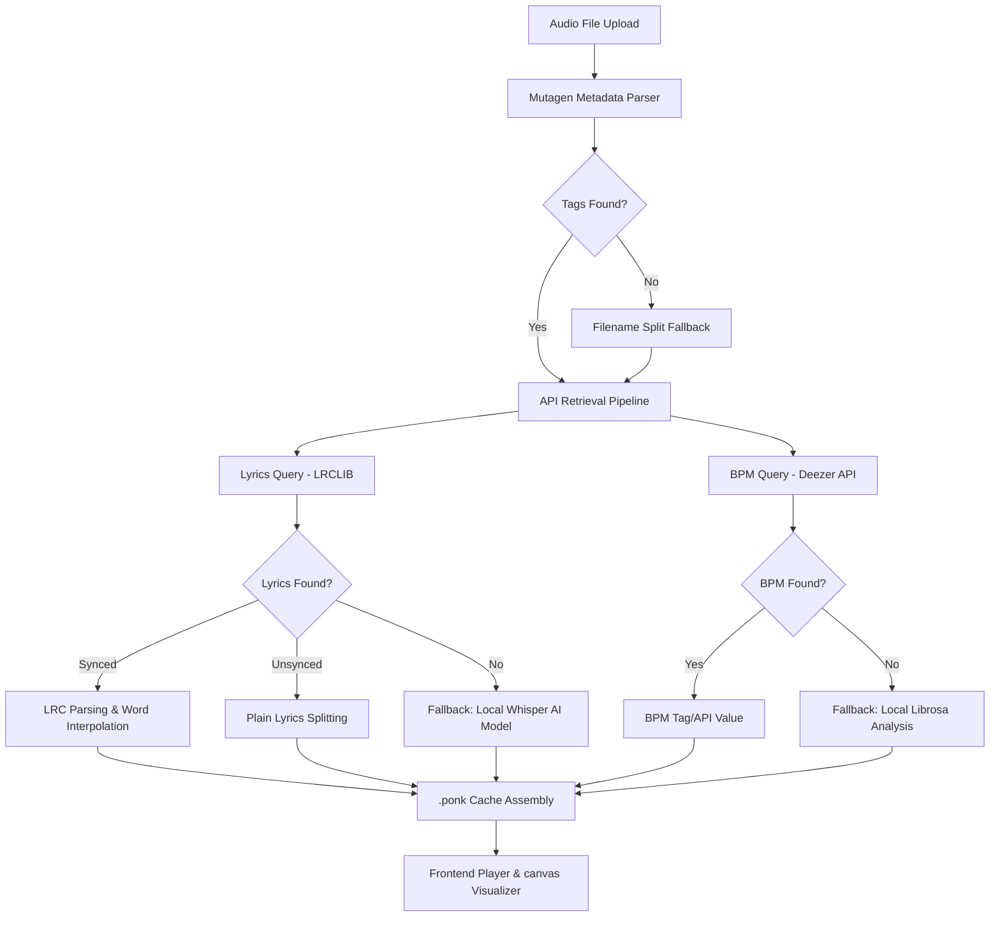

# Lyve (v1.0.0)

Lyve is a real-time, interactive lyric synchronizer and audio visualizer. By uploading an audio file, Lyve automatically retrieves track details (Artist, Title, Album), looks up synchronized LRC lyrics from the internet, and estimates the song's BPM to generate a stunning, typography-based visualizer.

The system is architected as a robust, packaging-compliant Python Web Application. It operates on a **metadata-first API-driven pipeline** with built-in fallbacks to local Machine Learning (Whisper AI) and Signal Processing (Librosa) algorithms when remote lookups are unavailable.

---

## Architecture Diagram



---

## Features

- **Smart Metadata Parsing**: Automatically extracts ID3, Vorbis Comments, and MP4/M4A atoms using `mutagen`. Parses custom filenames (e.g. `Artist - Title.mp3`) as a fallback.
- **LRCLIB Lyrics Sync**: Fetches synced and unsynced lyrics from [lrclib.net](https://lrclib.net) using strict `/api/get` lookups and duration-matched search algorithms.
- **Word-Level LRC Interpolation**: Translates standard line-level LRC timestamps into word-level schedules using a speed-of-speech heuristic (`max(0.15, min(0.4, line_duration / total_words))`).
- **Deezer BPM Lookup**: Connects to the public Deezer API to search and retrieve the official track BPM.
- **Resilient Local Fallbacks**: 
  - *Whisper AI*: Utilizes `faster-whisper` locally on CPU or GPU to generate word-level timestamp transcriptions.
  - *Librosa*: Runs onset strength envelope and beat tracking algorithms to estimate the tempo locally.
- **Local Cache Storage**: Automatically assemblies and stores cache assets in a custom `.ponk` JSON format to avoid hitting external APIs and model re-computations on subsequent uploads.

---

## Directory Structure

```
lyve/
├── __init__.py           # Application factory (create_app) & version metadata
├── config.py             # Global application configuration
├── routes.py             # Flask Blueprint controllers & REST endpoints
└── services/             # Core business logic layer
    ├── __init__.py
    ├── audio.py          # BPM extraction (Deezer API & Librosa analyzer)
    ├── lyrics.py         # Lyrics fetching (LRCLIB client & Whisper transcriber)
    ├── metadata.py       # Tag extractions (Mutagen & filename parser)
    └── worker.py         # Thread pools, caching, and async job workers
app.py                    # Lightweight server entrypoint runner
requirements.txt          # Python dependency checklist
static/                   # Frontend assets (CSS, client JS, images)
templates/                # Frontend HTML template layout (index.html)
uploads/                  # Git-ignored local audio storage (auto-cleaned)
cache/                    # Git-ignored generated .ponk cache assets (auto-cleaned)
```

---

## Installation & Setup

### Requirements
- Python 3.8+
- PyTorch (for Whisper AI local model)
- C++ Build Tools (sometimes required for librosa audio decoding libraries)

### Setup Virtual Environment
```bash
# Clone the repository
git clone https://github.com/ponkis/lyve.git
cd lyve

# Create a virtual environment
python -m venv venv

# Activate virtual environment
# On Windows:
venv\Scripts\activate
# On macOS/Linux:
source venv/bin/activate
```

### Install Dependencies
```bash
pip install --upgrade pip
pip install -r requirements.txt
```

---

## Running the Application

To start the Flask server locally:
```bash
python app.py
```
By default, the server runs on:
- Localhost: `http://127.0.0.1:5500`
- LAN Access: `http://<your-local-ip>:5500`

---

## REST Endpoints

### 1. `GET /`
Serves the visualizer home page.

### 2. `POST /upload`
Uploads an audio file for synchronizing.
- **Payload**: Multipart form-data with key `file`.
- **Response**: `202 Accepted` returning a `file_hash` for queue polling, or `200 OK` with cached `.ponk` data if already processed.

### 3. `GET /status/<file_hash>`
Check the status of a queued background job.
- **Response**: Returns current processing status (e.g. `queued`, `fetching_lyrics`, `ai_transcription`, `ready`) and progress percentage.

### 4. `GET /result/<file_hash>`
Retrieve the completed lyric and BPM payload.
- **Response**: Returns the compiled `.ponk` payload containing lyrics text, word-level timings, BPM, and track metadata.

---

## License

This project is licensed under the MIT License. See `LICENSE` for details.
